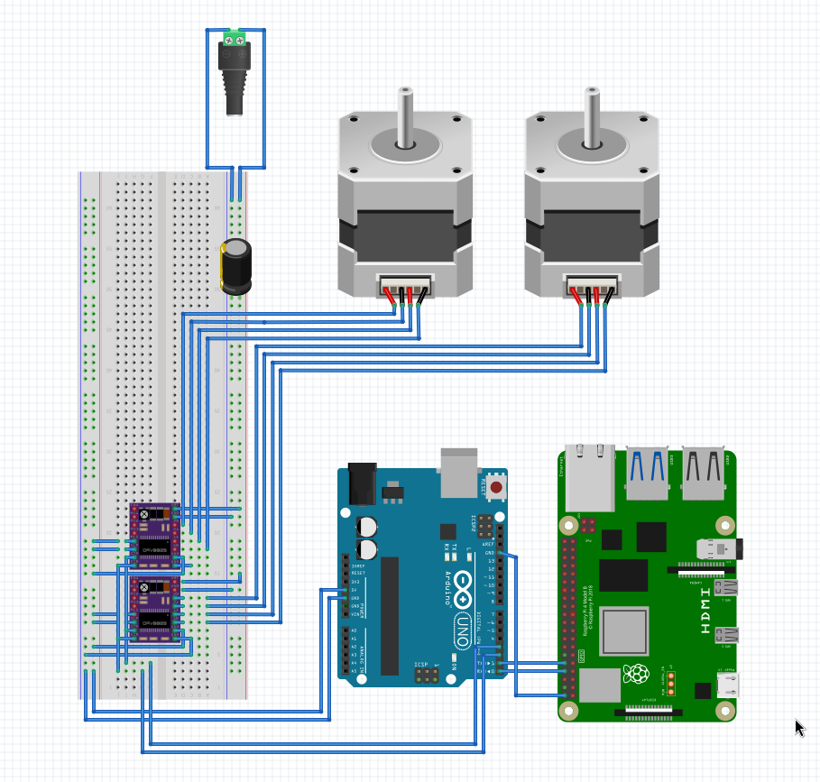

# StepperSongs

StepperSongs is a web-based application that allows users to play songs on a stepper motor. The stepper motor is controlled via an Arduino board, which receives commands via serial over USB, which themselves come from a client listening to an MQTT broker. The web application sends musical notes to the broker, which are then received by the client and sent to the Arudino to produce sound.

## Prerequisites

- Python 3.8 or higher.
- Arduino Uno or compatible board.
- MQTT broker (e.g., [test.mosquitto.org](test.mosquitto.org)).

## Setup Instructions

### 1. Clone the Repository

```bash
git clone https://github.com/your-repo/StepperSongs.git
cd StepperSongs
```

### 2. Set Up the Python Environment

```bash
python3 -m venv .venv
source .venv/bin/activate
pip install -r requirements.txt
```

### 3. Configure Environment Variables

Create a `.env` file in the root directory with the following content:

```env
MQTT_USERNAME=your_username
MQTT_PASSWORD=your_password
```

### 4. Upload the Arduino Code

1. Install [PlatformIO](https://platformio.org/) in your IDE (e.g., VSCode).
2. Open the `driver` folder in PlatformIO.
3. Connect your Arduino board and upload the `driver.ino` code.

### 5. Deploy the Web Application

Run the provided `run` script to copy the web files to the web server's root directory:

```bash
sudo ./run
```

This script will also start the Python client backend.

## Usage

### Web Interface

1. Open a browser and navigate to `http://localhost` (or your server's IP).
2. Enter your Client ID, MQTT username, and password.
3. Click "Connect" to enable the virtual piano.
4. Play notes by clicking on the piano keys.

### Backend

- The Python backend listens for MQTT messages and sends them to the Arduino via serial communication.
- Logs are displayed in the terminal for debugging.

### Arduino

- The Arduino receives notes via serial communication and plays them on the stepper motor.

### Hardware

A Fritzing diagram, for reference when setting up circuitry.



## Troubleshooting

- Ensure the correct serial port is set in the driver Python script (`/dev/ttyACM0` by default).
- Verify the MQTT broker credentials in the `.env` file.
- Check the browser console for errors if the web interface is not working.
- Ensure the Arduino is properly connected and powered.
- Rarely on project setup, the Python serial library gets weird and needs to be reinstalled. Please follow these steps if getting an error about `serial has no attribute Serial`:

```bash
.venv/bin/activate
pip3 uninstall pyserial
pip3 install pyserial
```

## Acknowledgments

Inspired by [Make Music With Stepper Motors!](https://www.instructables.com/Make-Music-With-Stepper-Motors/) by Whiteshadow11.
